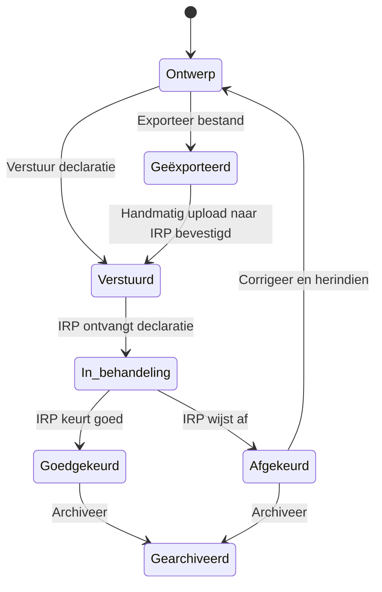
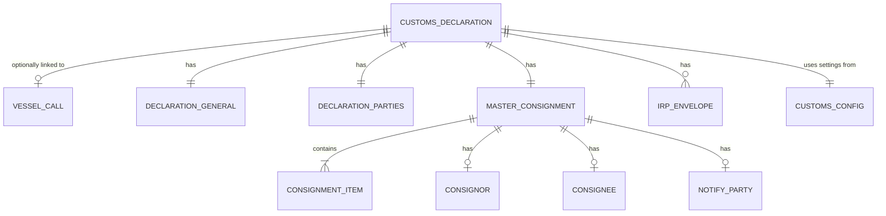
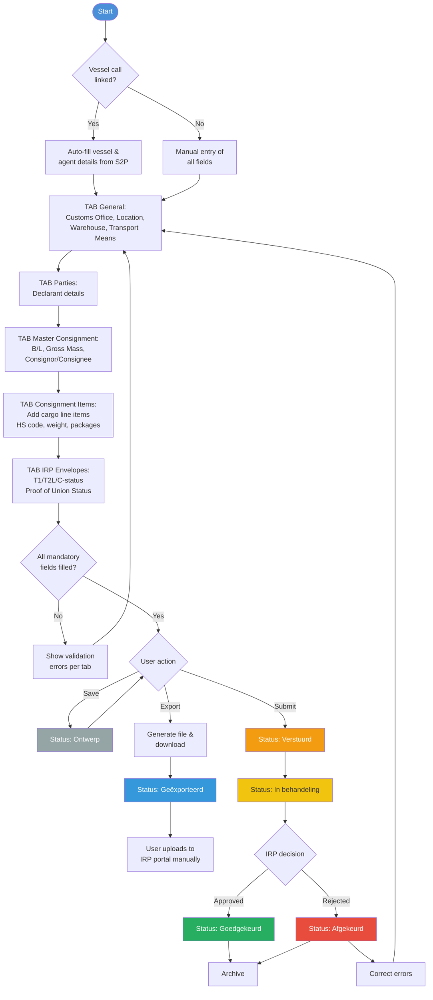

# S2P Custom Declarations Module — Design Specification

## 1. Overview

### 1.1 Purpose
Design a **Customs Declarations module** within the S2P (Ship2Port) platform for creating and managing **Temporary Storage Declarations (TSD)** to be submitted to **Belgian Customs (IRP)**. The module follows the same UI patterns as the existing PAX declarations module in S2P and mirrors the data structure and workflow from **Descartes**.

### 1.2 Scope

| Phase | Scope |
|-------|-------|
| **Phase 1** (MVP) | Internal staff creates and manages customs declarations on behalf of clients. File export for manual upload to IRP. |
| **Phase 2** | Clients gain read-only access to view declaration status and history. |
| **Phase 3** | Templates for recurring shipments, ICO terminal support, bulk import. |

### 1.3 Key Design Decisions

| Decision | Chosen approach |
|----------|----------------|
| Declaration type | Cargo/goods — Temporary Storage Declaration (TSD) |
| Target authority | Belgian Customs IRP |
| Integration method | File export (format TBD: IRP XML or CUSCAR) |
| Vessel link | Optional — declarations can be linked to a vessel call or created standalone |
| Identifier config | Separate customs-specific configuration (not reusing PAX EORI) |
| Auto-fill | Vessel details, agent/declarant details, and location codes from S2P |
| UI pattern | Same look & feel as PAX module |

---

## 2. User Interface Design

### 2.1 Navigation
A new top-level menu item **"Customs declaraties"** (Customs Declarations) is added alongside the existing "PAX declaraties" in the S2P navigation.

### 2.2 Overview Page (List View)
Mirrors the PAX declarations overview layout.

```
┌─────────────────────────────────────────────────────────────────────┐
│  Customs declaraties                                                │
│  Beheer douaneaangiften voor tijdelijke opslag (TSD)               │
│                                                                     │
│  ┌──────────────┐ ┌──────────────┐ ┌──────────────┐ ┌────────────┐│
│  │ Totaal       │ │ Goedgekeurd  │ │ In behande-  │ │ Totaal     ││
│  │ declaraties  │ │              │ │ ling         │ │ items      ││
│  │     --       │ │     --       │ │     --       │ │    --      ││
│  └──────────────┘ └──────────────┘ └──────────────┘ └────────────┘│
│                                                                     │
│  [+ Nieuwe declaratie]          [Customs configuratie]              │
│                                                                     │
│  ┌─────────────────────────┐ ┌──────────────────────────┐         │
│  │ Actieve declaraties (n) │ │ Gearchiveerde decl. (n)  │         │
│  └─────────────────────────┘ └──────────────────────────┘         │
│                                                                     │
│  ┌─────┬────────┬──────────┬────────┬──────┬───────┬──────┬──────┐│
│  │ UCR │ ETA    │ Status   │ Schip  │ Haven│ Agent │Status│Update││
│  │     │        │ aanloop  │        │      │       │decl. │      ││
│  ├─────┼────────┼──────────┼────────┼──────┼───────┼──────┼──────┤│
│  │ ... │ ...    │ Verwacht │ ...    │ ...  │ ...   │Ontw. │ ...  ││
│  │ ... │ ...    │ Gemeerd  │ ...    │ ...  │ ...   │Verst.│ ...  ││
│  └─────┴────────┴──────────┴────────┴──────┴───────┴──────┴──────┘│
└─────────────────────────────────────────────────────────────────────┘
```

**Summary cards:**
- **Totaal declaraties** — total number of declarations
- **Goedgekeurd** — approved by IRP
- **In behandeling** — submitted and awaiting IRP response
- **Totaal items** — total consignment items across all declarations

**Table columns:**
| Column | Description |
|--------|-------------|
| UCR-nummer | Unique Consignment Reference |
| ETA | Estimated time of arrival |
| Status aanloop | Vessel call status (Verwacht / Gemeerd / Vertrokken) |
| Scheepsnaam | Vessel name |
| Haven | Port |
| Agent | Declaring agent |
| Status declaratie | Declaration status (see §3) |
| Laatste update | Timestamp of last change |

### 2.3 Declaration Detail View (Tabbed Form)
When a user opens or creates a declaration, a tabbed form is shown — mirroring the Descartes tab structure.

```
┌─────────────────────────────────────────────────────────────────────┐
│  ← Terug naar overzicht                                            │
│                                                                     │
│  Customs declaratie — [VESSEL NAME]        Status: Ontwerp         │
│  UCR: [number]  |  IMO: [number]  |  ETA: [date]  |  Agent: [name]│
│                                                                     │
│  [Opslaan] [Exporteer bestand] [Verstuur declaratie] [Archief]     │
│                                                                     │
│  ┌─────────┬─────────┬──────────────────┬────────────┬───────────┐ │
│  │ General │ Parties │ Master Consignm. │ Cons.Items │ IRP Envel.│ │
│  └─────────┴─────────┴──────────────────┴────────────┴───────────┘ │
│                                                                     │
│  [TAB CONTENT — see sections 2.3.1 through 2.3.5]                 │
│                                                                     │
└─────────────────────────────────────────────────────────────────────┘
```

---

#### 2.3.1 TAB: General

Auto-filled fields are marked with **(A)**.

| Section | Field | Type | Default / Example | Notes |
|---------|-------|------|-------------------|-------|
| **Settings** | Response Language | Dropdown | "EN" | EN / FR / NL |
| | Send to IRP | Toggle/Select | "1" (Yes) | 1 = Yes, 0 = No |
| | Customs Office | Dropdown | e.g. "BE101000" | Configurable list |
| **Border Transport Means** | IMO Number | Text | **(A)** from vessel call | |
| | Stay Reference | Text | **(A)** from vessel call | |
| | Vessel Name | Text | **(A)** from vessel call | |
| | Identification Type | Dropdown | "10" | IMO ship identification |
| | Voyage Number | Text | **(A)** from S2P | |
| | Date | Date picker | **(A)** ETA from vessel call | |
| **Location of Goods** | Location Type | Dropdown | "B" | |
| | Qualifier | Dropdown | "U" | |
| | UN/LOCODE | Text/Dropdown | **(A)** e.g. "BEBUANR000148" | From location config |
| **Warehouse & Unloading** | Warehouse Identifier | Text | **(A)** e.g. "BETST2400370" | From config |
| | Warehouse Type | Dropdown | "V" | |
| | Unloading Place | Text | **(A)** e.g. "BEBUANR000148" | From location config |
| **Place of Loading & Destination** | Loading UN/LOCODE | Text/Dropdown | | Port of loading |
| | Discharge UN/LOCODE | Text/Dropdown | **(A)** | Port of discharge |

---

#### 2.3.2 TAB: Parties

| Section | Field | Type | Notes |
|---------|-------|------|-------|
| **Declarant** | Company Name | Text | **(A)** from agent profile |
| | EORI Number | Text | From customs config |
| | Address | Text | **(A)** from agent profile |
| | City | Text | **(A)** |
| | Country | Dropdown | **(A)** |
| | Postal Code | Text | **(A)** |
| **Communication** | Email Address | Email | **(A)** from agent profile |

> **Phase 3 note:** Trading Partner fields for ICO terminals will be added here.

---

#### 2.3.3 TAB: Master Consignment

| Section | Field | Type | Notes |
|---------|-------|------|-------|
| **Transport Document** | Document Identifier | Text | B/L number |
| | Document Type | Dropdown | Default "N705" |
| **Totals** | Total Gross Mass | Number (kg) | Sum of all items (can be overridden) |
| **Previous Document** | Document Reference | Text | Previous MRN (if applicable) |
| | Document Type | Dropdown | Default "N355" |
| **Consignor** | Name | Text | |
| | Type | Dropdown | Default "2" (Legal person) |
| | Address, City, Country, Postal Code | Text/Dropdown | |
| **Consignee** | Name | Text | |
| | Type | Dropdown | Default "2" (Legal person) |
| | Address, City, Country, Postal Code | Text/Dropdown | |
| **Notify Party** *(optional)* | Name | Text | |
| | Type | Dropdown | Default "2" (Legal person) |
| | Address, City, Country, Postal Code | Text/Dropdown | |

---

#### 2.3.4 TAB: Master Consignment Items

A list of cargo line items. Each item is a row that can be expanded/edited.

| Field | Type | Notes |
|-------|------|-------|
| Description of Goods | Text | Free text commodity description |
| HS Code | Text (6-8 digits) | Harmonised commodity code |
| Gross Mass | Number (kg) | Weight of this item |
| TE Packed Status/Type | Dropdown | Default "8006" (Breakbulk) |
| Type of Packages | Dropdown | Standard packaging codes |
| Quantity of Packages | Number | |

**Action buttons per item:** Edit, Duplicate, Delete

**Special rules — Empty containers:**

| Field | ISO Container | NON-ISO Container |
|-------|--------------|-------------------|
| HS Code | 860900 | 860900 |
| Type of Packages | CN | CN |
| Quantity | 1 | 1 |
| TE Packed Status | A | * (see Descartes manual) |

> **Note:** A distinction must be made between ISO and non-ISO empty containers in free circulation vs. empty containers as goods (e.g., new-build containers). The system should provide guidance or a selection helper for this scenario.

---

#### 2.3.5 TAB: IRP Envelopes

Controls the customs status of goods (T1 / T2L / C-status).

| Section | Field | Type | Notes |
|---------|-------|------|-------|
| **Proof of Union Status (T2L)** | Document Reference | Text | Previous MRN (e.g., from Italy) |
| | Document Type | Dropdown | "C620" |
| **Cargo Manifest (C-status)** | Document Reference | Text | Permit/authorization number |
| | Document Type | Dropdown | "N785" |

**Logic:**
- If **no** proof of union status is entered → goods are treated as **T1** (non-Union goods)
- If **C620** document is entered → goods are treated as **T2L** (Union goods with proof)
- If **N785** document is entered → goods have **C-status** (cargo manifest authorization)

A pop-up form is used for adding/editing proof documents (same as Descartes):
```
┌──────────────────────────────────┐
│  Proof of Union Status           │
│                                  │
│  Document Reference: [________]  │
│  Type: [C620 ▼]                  │
│                                  │
│  [Annuleren]  [Opslaan]         │
└──────────────────────────────────┘
```

---

## 3. Workflow & Statuses

### 3.1 Declaration Statuses



| Status | Dutch | Color | Description |
|--------|-------|-------|-------------|
| Draft | Ontwerp | Grey | Declaration is being created/edited |
| Exported | Geëxporteerd | Blue | File exported, pending manual upload to IRP |
| Submitted | Verstuurd | Orange | Declaration submitted to IRP |
| In Progress | In behandeling | Yellow | IRP is processing |
| Approved | Goedgekeurd | Green | IRP approved the declaration |
| Rejected | Afgekeurd | Red | IRP rejected — corrections needed |
| Archived | Gearchiveerd | Light grey | No longer active |

### 3.2 User Actions per Status

| Action | Ontwerp | Geëxporteerd | Verstuurd | In behandeling | Goedgekeurd | Afgekeurd |
|--------|---------|-------------|-----------|----------------|-------------|-----------|
| Edit fields | Yes | Yes | No | No | No | Yes (creates new version) |
| Export file | Yes | Yes | No | No | Yes (for records) | No |
| Submit | Yes | Yes | No | No | No | No |
| Archive | No | No | No | No | Yes | Yes |
| View | Yes | Yes | Yes | Yes | Yes | Yes |

---

## 4. Data Model

### 4.1 Entity Relationship



### 4.2 Core Tables

#### `customs_declaration`
| Column | Type | Description |
|--------|------|-------------|
| id | UUID | Primary key |
| ucr_number | VARCHAR | Unique Consignment Reference |
| vessel_call_id | UUID (nullable) | FK to vessel call (optional link) |
| status | ENUM | Ontwerp / Geëxporteerd / Verstuurd / In_behandeling / Goedgekeurd / Afgekeurd / Gearchiveerd |
| response_language | VARCHAR(2) | EN / FR / NL |
| send_to_irp | BOOLEAN | Flag for IRP submission |
| customs_office | VARCHAR(20) | e.g. "BE101000" |
| created_by | UUID | FK to user |
| created_at | TIMESTAMP | |
| updated_at | TIMESTAMP | |

#### `declaration_border_transport`
| Column | Type | Description |
|--------|------|-------------|
| declaration_id | UUID | FK |
| imo_number | VARCHAR | IMO ship number |
| stay_reference | VARCHAR | |
| vessel_name | VARCHAR | |
| identification_type | VARCHAR | Default "10" |
| voyage_number | VARCHAR | |
| transport_date | DATE | |

#### `declaration_location`
| Column | Type | Description |
|--------|------|-------------|
| declaration_id | UUID | FK |
| location_type | VARCHAR | "B" |
| qualifier | VARCHAR | "U" |
| un_locode | VARCHAR | e.g. "BEBUANR000148" |
| warehouse_identifier | VARCHAR | e.g. "BETST2400370" |
| warehouse_type | VARCHAR | "V" |
| unloading_place | VARCHAR | |
| loading_locode | VARCHAR | Port of loading |
| discharge_locode | VARCHAR | Port of discharge |

#### `declaration_party`
| Column | Type | Description |
|--------|------|-------------|
| id | UUID | Primary key |
| declaration_id | UUID | FK |
| role | ENUM | declarant / consignor / consignee / notify_party |
| name | VARCHAR | |
| type | VARCHAR | "2" (Legal person) |
| eori_number | VARCHAR | |
| address | VARCHAR | |
| city | VARCHAR | |
| country | VARCHAR(2) | |
| postal_code | VARCHAR | |
| email | VARCHAR (nullable) | Only for declarant |

#### `master_consignment`
| Column | Type | Description |
|--------|------|-------------|
| declaration_id | UUID | FK |
| transport_doc_identifier | VARCHAR | B/L number |
| transport_doc_type | VARCHAR | Default "N705" |
| total_gross_mass | DECIMAL | Total weight in kg |
| previous_doc_reference | VARCHAR (nullable) | Previous MRN |
| previous_doc_type | VARCHAR (nullable) | Default "N355" |

#### `consignment_item`
| Column | Type | Description |
|--------|------|-------------|
| id | UUID | Primary key |
| master_consignment_id | UUID | FK |
| item_number | INTEGER | Sequence number |
| goods_description | TEXT | |
| hs_code | VARCHAR(8) | Harmonised commodity code |
| gross_mass | DECIMAL | Weight in kg |
| te_packed_status | VARCHAR | Default "8006" (Breakbulk) |
| package_type | VARCHAR | Packaging code |
| package_quantity | INTEGER | |

#### `irp_envelope`
| Column | Type | Description |
|--------|------|-------------|
| id | UUID | Primary key |
| declaration_id | UUID | FK |
| document_reference | VARCHAR | MRN or authorization number |
| document_type | VARCHAR | "C620" (T2L) or "N785" (C-status) |

#### `customs_config`
| Column | Type | Description |
|--------|------|-------------|
| id | UUID | Primary key |
| company_id | UUID | FK to company |
| customs_registration_number | VARCHAR | |
| default_customs_office | VARCHAR | |
| default_warehouse_identifier | VARCHAR | |
| default_warehouse_type | VARCHAR | |
| default_un_locode | VARCHAR | |

---

## 5. Auto-Fill Logic

When creating a new declaration **linked to a vessel call**, the following fields are pre-populated:

| Field | Source |
|-------|--------|
| IMO Number | Vessel call → vessel.imo |
| Stay Reference | Vessel call → stay_reference |
| Vessel Name | Vessel call → vessel.name |
| Voyage Number | Vessel call → voyage_number |
| Transport Date (ETA) | Vessel call → eta |
| Discharge UN/LOCODE | Vessel call → port.un_locode |
| Declarant (all fields) | Current user → company profile |
| Customs Office | Customs config → default_customs_office |
| UN/LOCODE (Location) | Customs config → default_un_locode |
| Warehouse Identifier | Customs config → default_warehouse_identifier |
| Warehouse Type | Customs config → default_warehouse_type |
| Unloading Place | Customs config → default_un_locode |

When creating a **standalone** declaration (no vessel link), only the agent/config-based fields are pre-populated. Vessel fields must be entered manually.

---

## 6. File Export

### 6.1 Export Functionality
- **Action:** User clicks "Exporteer bestand" button
- **Output:** Downloads a structured file containing the full TSD declaration
- **Format:** TBD — to be determined based on IRP requirements (likely XML or CUSCAR/EDIFACT)
- **User then:** Manually uploads the file to the Belgian IRP portal

### 6.2 Export Validation
Before export, the system validates all mandatory fields are filled:

**Mandatory for export:**
- Customs Office
- All Border Transport Means fields
- Location of Goods (UN/LOCODE)
- Warehouse Identifier
- Declarant details (name, EORI)
- At least one Transport Document
- Total Gross Mass
- At least one Consignment Item with: Description, HS Code, Gross Mass, Package Type & Quantity

**Validation errors** are shown inline on the relevant tab with a red indicator on the tab header.

---

## 7. Configuration Page ("Customs configuratie")

Accessible via the **[Customs configuratie]** button on the overview page. Separate from PAX EORI configuration.

| Setting | Description |
|---------|-------------|
| Customs Registration Number | Company's Belgian customs registration |
| Default Customs Office | Pre-selected customs office code |
| Default Warehouse Identifier | e.g. "BETST2400370" |
| Default Warehouse Type | e.g. "V" |
| Default UN/LOCODE | e.g. "BEBUANR000148" |
| Location-to-LOCODE Mapping | Map S2P terminals/locations to UN/LOCODEs |

---

## 8. Phase 2 — Client Status View

In a future phase, clients (shipping agents, freight forwarders) can log in and see:

- A **read-only list** of their declarations with statuses
- **Filter** by status, vessel, date range
- **Detail view** of each declaration (read-only)
- **Notifications** (email) when status changes (e.g., Goedgekeurd / Afgekeurd)

---

## 9. Phase 3 — Future Enhancements

| Feature | Description |
|---------|-------------|
| **Templates** | Save declarations as templates for recurring shipments/routes |
| **ICO Terminal Support** | Trading Partner configuration for ICO terminals (ICOSIT, ICONIT, ICOVRASENE) |
| **Bulk Import** | Upload cargo item lists from Excel/CSV |
| **Direct IRP Integration** | API connection to IRP for automated submission and status polling |
| **ISPS Link** | Create ISPS access requests directly from a customs declaration (like PAX → "Maak ISPS-verzoek") |

---

## 10. Process Flowchart



---

*Document version: 1.0 — Created: 2026-02-12*
*Based on: Descartes TSD manual & S2P PAX module design*
