# Ship2port — ISPS Aanmeldingsflow / ISPS Registration Flow

## 24/7 Haventoegang via QR-code / 24/7 Port Access via QR Code

```mermaid
flowchart TD
    START([🔗 Bezoeker opent Ship2port portaal\nVisitor opens Ship2port portal]) --> LANG{🌐 Taalkeuze\nLanguage selection}
    LANG -->|Nederlands| REG
    LANG -->|English| REG

    REG[📝 Registratie / Registration\n- Naam / Name\n- E-mail\n- Telefoonnummer / Phone\n- Bedrijf / Company]
    REG --> TYPE{👤 Bezoekerstype?\nVisitor type?}

    TYPE -->|Bemanning\nCrew| SHIP_INFO
    TYPE -->|Contractor\nContractor| SHIP_INFO
    TYPE -->|Inspecteur\nInspector| SHIP_INFO
    TYPE -->|Familiebezoek\nFamily visit| SHIP_INFO

    SHIP_INFO[🚢 Scheepsinformatie / Ship Information\n- Scheepsnaam / Ship name\n- IMO-nummer / IMO number\n- Terminal\n- Bezoekdoel / Visit purpose\n- Gewenste datum-tijd / Desired date-time]
    SHIP_INFO --> QR_TYPE{🎫 Type QR-code?\nQR code type?}

    QR_TYPE -->|Eenmalig\nSingle use| ID_VERIFY
    QR_TYPE -->|Meervoudig gebruik\nMultiple use| MULTI_PERIOD

    MULTI_PERIOD[📅 Geldigheidsduur opgeven\nSpecify validity period\n- Startdatum / Start date\n- Einddatum / End date]
    MULTI_PERIOD --> ID_VERIFY

    ID_VERIFY[🪪 ID-verificatie / ID Verification\n- Scan paspoort of ID-kaart\n  Scan passport or ID card\n- NFC-chip uitlezen of OCR\n  NFC chip read or OCR]
    ID_VERIFY --> ID_VALID{✅ Document geldig?\nDocument valid?}

    ID_VALID -->|Nee / No| ID_FAIL([❌ Verificatie mislukt\nVerification failed\n--- Einde flow / End of flow ---\nNeem contact op met scheepsagent\nContact shipping agent])
    ID_VALID -->|Ja / Yes| BIO_CHECK

    BIO_CHECK[📸 Biometrische controle\nBiometric check\n- Live foto maken\n  Take live photo\n- Vergelijking met ID-document\n  Comparison with ID document]
    BIO_CHECK --> BIO_MATCH{🔍 Biometrische match?\nBiometric match?}

    BIO_MATCH -->|Nee / No| BIO_FAIL([❌ Biometrische check mislukt\nBiometric check failed\n--- Einde flow / End of flow ---\nNeem contact op met scheepsagent\nContact shipping agent])
    BIO_MATCH -->|Ja / Yes| SUBMIT

    SUBMIT[📤 Aanvraag ingediend\nRequest submitted\n- Wacht op goedkeuringen\n  Awaiting approvals]
    SUBMIT --> AGENT_REVIEW

    AGENT_REVIEW{🏢 Scheepsagent\ngoedkeuring?\nShipping agent\napproval?}
    AGENT_REVIEW -->|Afgewezen\nRejected| AGENT_REJECT([❌ Afgewezen door scheepsagent\nRejected by shipping agent\n--- Einde flow / End of flow ---])
    AGENT_REVIEW -->|Goedgekeurd\nApproved| TERMINAL_REVIEW

    TERMINAL_REVIEW{🏗️ Terminal\ngoedkeuring?\nTerminal\napproval?}
    TERMINAL_REVIEW -->|Afgewezen\nRejected| TERMINAL_REJECT([❌ Afgewezen door terminal\nRejected by terminal\n--- Einde flow / End of flow ---])
    TERMINAL_REVIEW -->|Goedgekeurd\nApproved| SHIP_CHECK

    SHIP_CHECK{⚓ Schip aanwezig\nin haven?\nShip present\nin port?}
    SHIP_CHECK -->|Nee / No| WAIT[⏳ Wachten op aankomst schip\nWaiting for ship arrival\n- Melding bij aankomst\n  Notification on arrival]
    WAIT --> SHIP_CHECK
    SHIP_CHECK -->|Ja / Yes| QR_GEN

    QR_GEN[✅ QR-code gegenereerd!\nQR code generated!\n- Verzonden per e-mail + SMS\n  Sent via email + SMS\n- Geldig volgens gekozen type\n  Valid per selected type]
    QR_GEN --> GATE

    GATE([🚪 Bezoeker scant QR bij poort\nVisitor scans QR at gate\n--- Toegang verleend / Access granted ---])

    %% Styling
    style START fill:#1a73e8,stroke:#1558b0,color:#fff
    style GATE fill:#0d904f,stroke:#0a7340,color:#fff
    style ID_FAIL fill:#d93025,stroke:#b3261e,color:#fff
    style BIO_FAIL fill:#d93025,stroke:#b3261e,color:#fff
    style AGENT_REJECT fill:#d93025,stroke:#b3261e,color:#fff
    style TERMINAL_REJECT fill:#d93025,stroke:#b3261e,color:#fff
    style QR_GEN fill:#0d904f,stroke:#0a7340,color:#fff
    style SUBMIT fill:#f9ab00,stroke:#e69500,color:#000
    style WAIT fill:#f9ab00,stroke:#e69500,color:#000
```

## Toelichting / Explanation

### Processtappen / Process Steps

| Stap | NL | EN |
|------|----|----|
| 1 | Bezoeker opent portaal (via link of QR op locatie) | Visitor opens portal (via link or on-site QR) |
| 2 | Taalkeuze: Nederlands of Engels | Language selection: Dutch or English |
| 3 | Persoonlijke registratie | Personal registration |
| 4 | Bezoekerstype selecteren | Select visitor type |
| 5 | Scheeps- en bezoekgegevens invoeren | Enter ship and visit details |
| 6 | QR-type kiezen (eenmalig of meervoudig) | Choose QR type (single or multiple use) |
| 7 | Paspoort/ID-kaart scannen (NFC of OCR) | Scan passport/ID card (NFC or OCR) |
| 8 | Live foto voor biometrische verificatie | Live photo for biometric verification |
| 9 | Wachten op goedkeuring scheepsagent | Await shipping agent approval |
| 10 | Wachten op goedkeuring terminal | Await terminal approval |
| 11 | Controle of schip aanwezig is | Check if ship is present |
| 12 | QR-code wordt gegenereerd en verzonden | QR code is generated and sent |
| 13 | Bezoeker scant QR bij poort voor toegang | Visitor scans QR at gate for access |

### Bezoekerstypen / Visitor Types

| Type | NL | EN | Opmerking |
|------|----|----|-----------|
| 👷 | Bemanning | Crew | Bemanningswissel / Crew change |
| 🔧 | Contractor | Contractor | Onderhoud, reparatie / Maintenance, repair |
| 🔎 | Inspecteur | Inspector | Vlag, klasse, haven / Flag, class, port state |
| 👨‍👩‍👧 | Familie | Family | Persoonlijk bezoek / Personal visit |

### Afwijzingsmomenten / Rejection Points

Er zijn **4 momenten** waarop de flow kan eindigen met een afwijzing:

1. **ID-verificatie mislukt** — Document ongeldig of onleesbaar
2. **Biometrische check mislukt** — Foto komt niet overeen met ID
3. **Scheepsagent wijst af** — Bezoek niet goedgekeurd door agent
4. **Terminal wijst af** — Terminal weigert toegang

Bij elke afwijzing is het **einde van de flow**. De bezoeker moet opnieuw beginnen of buiten het systeem contact opnemen.

### QR-code Types

| Type | Geldigheid | Gebruik |
|------|-----------|---------|
| Eenmalig / Single use | Verloopt na één scan | Eenmalig bezoek |
| Meervoudig / Multiple use | Geldig binnen opgegeven periode | Terugkerend bezoek (bijv. contractor) |
